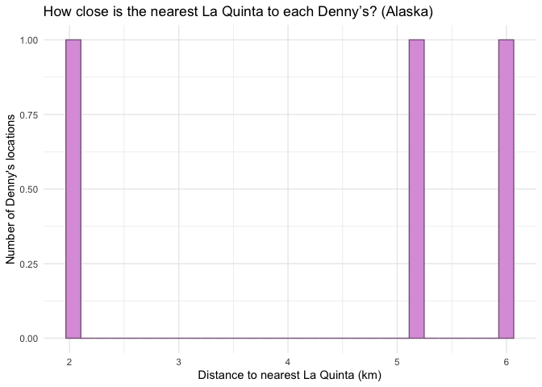
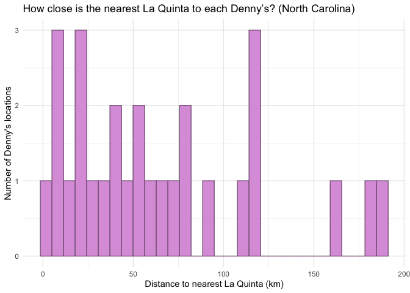
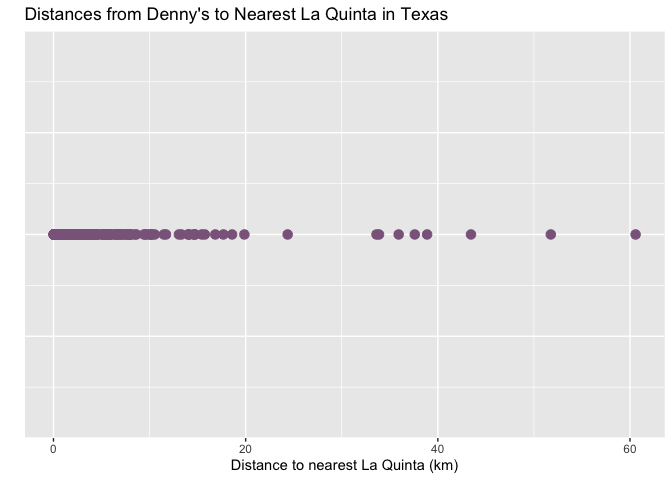
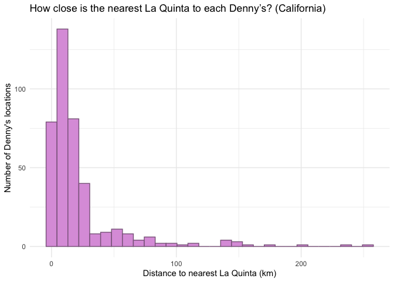

Lab 05 - Wrangling spatial data
================
Anaelle Gackiere
02-13-2026

### Load packages and data

``` r
library(tidyverse) 
library(dsbox) 
```

``` r
states <- read_csv("data/states.csv")
```

### Exercise 1

``` r
# Filter the Denny’s df for Alaska
dn_ak <- dennys %>%
  filter(state == "AK")
nrow(dn_ak)
```

    ## [1] 3

``` r
# Filter the La Quinta df for Alaska
lq_ak <- laquinta %>%
  filter(state == "AK")
nrow(lq_ak)
```

    ## [1] 2

There are 3 Denny’s locations in Alaska and 2La Quinta locations in
Alaska.

### Exercise 2

``` r
# Calculate the number of pairings using the data frames you have already made

n_pairings <- nrow(dn_ak) * nrow(lq_ak)
n_pairings
```

    ## [1] 6

There are 6 pairings to be made.

### Exercise 3

``` r
dn_lq_ak <- full_join(dn_ak, lq_ak,
  by = "state"
)
```

    ## Warning in full_join(dn_ak, lq_ak, by = "state"): Detected an unexpected many-to-many relationship between `x` and `y`.
    ## ℹ Row 1 of `x` matches multiple rows in `y`.
    ## ℹ Row 1 of `y` matches multiple rows in `x`.
    ## ℹ If a many-to-many relationship is expected, set `relationship =
    ##   "many-to-many"` to silence this warning.

``` r
dn_lq_ak
```

    ## # A tibble: 6 × 11
    ##   address.x     city.x state zip.x longitude.x latitude.x address.y city.y zip.y
    ##   <chr>         <chr>  <chr> <chr>       <dbl>      <dbl> <chr>     <chr>  <chr>
    ## 1 2900 Denali   Ancho… AK    99503       -150.       61.2 3501 Min… "\nAn… 99503
    ## 2 2900 Denali   Ancho… AK    99503       -150.       61.2 4920 Dal… "\nFa… 99709
    ## 3 3850 Debarr … Ancho… AK    99508       -150.       61.2 3501 Min… "\nAn… 99503
    ## 4 3850 Debarr … Ancho… AK    99508       -150.       61.2 4920 Dal… "\nFa… 99709
    ## 5 1929 Airport… Fairb… AK    99701       -148.       64.8 3501 Min… "\nAn… 99503
    ## 6 1929 Airport… Fairb… AK    99701       -148.       64.8 4920 Dal… "\nFa… 99709
    ## # ℹ 2 more variables: longitude.y <dbl>, latitude.y <dbl>

…

### Exercise 4

There are 6 observations in the joined dataframe. The names of the
variables are address, city, state, zip, longitude, latitude (all have
.x and. y, apart from state since we joined by state).

``` r
# check variable names
names(dn_lq_ak)
```

    ##  [1] "address.x"   "city.x"      "state"       "zip.x"       "longitude.x"
    ##  [6] "latitude.x"  "address.y"   "city.y"      "zip.y"       "longitude.y"
    ## [11] "latitude.y"

…

### Exercise 5

We use the function mutate() from the tidyverse to add a new variable to
a data frame while keeping the existing variables.

``` r
haversine <- function(long1, lat1, long2, lat2, round = 3) {
  # convert to radians
  long1 <- long1 * pi / 180
  lat1 <- lat1 * pi / 180
  long2 <- long2 * pi / 180
  lat2 <- lat2 * pi / 180

  R <- 6371 # Earth mean radius in km

  a <- sin((lat2 - lat1) / 2)^2 + cos(lat1) * cos(lat2) * sin((long2 - long1) / 2)^2
  d <- R * 2 * asin(sqrt(a))

  return(round(d, round)) # distance in km
}
```

…

### Exercise 6

``` r
dn_lq_ak <- dn_lq_ak %>%
  mutate(distance = haversine(longitude.x, latitude.x,
                              longitude.y, latitude.y))
        
# checking it worked                              
head(dn_lq_ak$distance)
```

    ## [1]   2.035 416.031   5.998 413.653 419.879   5.197

…

### Exercise 7

``` r
# grouby by Denny's locations + new var w info for minimum distance

dn_lq_ak_mindist <- dn_lq_ak %>%
  group_by(address.x) %>%
  mutate(distance = haversine(longitude.x, latitude.x, longitude.y, latitude.y)) %>%
  summarize(closest = min(distance, na.rm = TRUE), .groups = "drop")

# check 
dn_lq_ak_mindist
```

    ## # A tibble: 3 × 2
    ##   address.x        closest
    ##   <chr>              <dbl>
    ## 1 1929 Airport Way    5.20
    ## 2 2900 Denali         2.04
    ## 3 3850 Debarr Road    6.00

…

### Exercise 8

``` r
# summary statistics
summary(dn_lq_ak_mindist)
```

    ##   address.x            closest     
    ##  Length:3           Min.   :2.035  
    ##  Class :character   1st Qu.:3.616  
    ##  Mode  :character   Median :5.197  
    ##                     Mean   :4.410  
    ##                     3rd Qu.:5.598  
    ##                     Max.   :5.998

``` r
# visualize! 
ggplot(dn_lq_ak_mindist, aes(x = closest)) +
  geom_histogram(bins = 30, fill = "plum", color = "plum4") +
  labs(
    x = "Distance to nearest La Quinta (km)",
    y = "Number of Denny's locations",
    title = "How close is the nearest La Quinta to each Denny’s? (Alaska)"
  ) +
  theme_minimal()
```

<!-- -->

…

### Exercise 9: North Carolina

``` r
# Filter the Denny’s df for NC
dn_nc <- dennys %>%
  filter(state == "NC")
nrow(dn_nc)
```

    ## [1] 28

``` r
# Filter the La Quinta df for NC
lq_nc <- laquinta %>%
  filter(state == "NC")
nrow(lq_nc)
```

    ## [1] 12

``` r
n_pairings <- nrow(dn_nc) * nrow(lq_nc)
n_pairings
```

    ## [1] 336

``` r
dn_lq_nc <- full_join(dn_nc, lq_nc,
  by = "state"
)
```

    ## Warning in full_join(dn_nc, lq_nc, by = "state"): Detected an unexpected many-to-many relationship between `x` and `y`.
    ## ℹ Row 1 of `x` matches multiple rows in `y`.
    ## ℹ Row 1 of `y` matches multiple rows in `x`.
    ## ℹ If a many-to-many relationship is expected, set `relationship =
    ##   "many-to-many"` to silence this warning.

``` r
dn_lq_nc
```

    ## # A tibble: 336 × 11
    ##    address.x    city.x state zip.x longitude.x latitude.x address.y city.y zip.y
    ##    <chr>        <chr>  <chr> <chr>       <dbl>      <dbl> <chr>     <chr>  <chr>
    ##  1 1 Regent Pa… Ashev… NC    28806       -82.6       35.6 165 Hwy … "\nBo… 28607
    ##  2 1 Regent Pa… Ashev… NC    28806       -82.6       35.6 3127 Slo… "\nCh… 28208
    ##  3 1 Regent Pa… Ashev… NC    28806       -82.6       35.6 4900 Sou… "\nCh… 28217
    ##  4 1 Regent Pa… Ashev… NC    28806       -82.6       35.6 4414 Dur… "\nDu… 27707
    ##  5 1 Regent Pa… Ashev… NC    28806       -82.6       35.6 1910 Wes… "\nDu… 27713
    ##  6 1 Regent Pa… Ashev… NC    28806       -82.6       35.6 1201 Lan… "\nGr… 27407
    ##  7 1 Regent Pa… Ashev… NC    28806       -82.6       35.6 1607 Fai… "\nCo… 28613
    ##  8 1 Regent Pa… Ashev… NC    28806       -82.6       35.6 191 Cres… "\nCa… 27518
    ##  9 1 Regent Pa… Ashev… NC    28806       -82.6       35.6 2211 Sum… "\nRa… 27612
    ## 10 1 Regent Pa… Ashev… NC    28806       -82.6       35.6 1001 Aer… "\nMo… 27560
    ## # ℹ 326 more rows
    ## # ℹ 2 more variables: longitude.y <dbl>, latitude.y <dbl>

``` r
# distance
dn_lq_nc <- dn_lq_nc %>%
  mutate(distance = haversine(longitude.x, latitude.x,
                              longitude.y, latitude.y))
        
# checking it worked                              
head(dn_lq_nc$distance)
```

    ## [1] 107.801 155.423 159.913 328.301 334.918 247.847

``` r
# grouby by Denny's locations + new var w info for minimum distance

dn_lq_nc_mindist <- dn_lq_nc %>%
  group_by(address.x) %>%
  mutate(distance = haversine(longitude.x, latitude.x, longitude.y, latitude.y)) %>%
  summarize(closest = min(distance, na.rm = TRUE), .groups = "drop")

# check 
dn_lq_nc_mindist
```

    ## # A tibble: 28 × 2
    ##    address.x                 closest
    ##    <chr>                       <dbl>
    ##  1 1 Regent Park Boulevard     108. 
    ##  2 101 Wintergreen Dr          120. 
    ##  3 103 Sedgehill Dr             26.7
    ##  4 1043 Jimmie Kerr Road        36.1
    ##  5 1201 S College Road         188. 
    ##  6 1209 Burkemount Avenue       39.1
    ##  7 1493 Us Hwy 74-A Bypass      70.1
    ##  8 1524 Dabney Dr               59.5
    ##  9 1550 Four Seasons           115. 
    ## 10 1800 Princeton-Kenly Road    55.9
    ## # ℹ 18 more rows

``` r
# summary statistics
summary(dn_lq_nc_mindist)
```

    ##   address.x            closest       
    ##  Length:28          Min.   :  1.779  
    ##  Class :character   1st Qu.: 22.388  
    ##  Mode  :character   Median : 53.456  
    ##                     Mean   : 65.444  
    ##                     3rd Qu.: 93.985  
    ##                     Max.   :187.935

``` r
# visualize! 
ggplot(dn_lq_nc_mindist, aes(x = closest)) +
  geom_histogram(bins = 30, fill = "plum", color = "plum4") +
  labs(
    x = "Distance to nearest La Quinta (km)",
    y = "Number of Denny's locations",
    title = "How close is the nearest La Quinta to each Denny’s? (North Carolina)"
  ) +
  theme_minimal()
```

<!-- -->

…

### Exercise 10: Texas

``` r
# Filter the Denny’s df for TX
dn_tx <- dennys %>%
  filter(state == "TX")
nrow(dn_tx)
```

    ## [1] 200

``` r
# Filter the La Quinta df for TX
lq_tx <- laquinta %>%
  filter(state == "TX")
nrow(lq_tx)
```

    ## [1] 237

``` r
n_pairings <- nrow(dn_tx) * nrow(lq_tx)
n_pairings
```

    ## [1] 47400

``` r
dn_lq_tx <- full_join(dn_tx, lq_tx,
  by = "state"
)
```

    ## Warning in full_join(dn_tx, lq_tx, by = "state"): Detected an unexpected many-to-many relationship between `x` and `y`.
    ## ℹ Row 1 of `x` matches multiple rows in `y`.
    ## ℹ Row 1 of `y` matches multiple rows in `x`.
    ## ℹ If a many-to-many relationship is expected, set `relationship =
    ##   "many-to-many"` to silence this warning.

``` r
dn_lq_tx
```

    ## # A tibble: 47,400 × 11
    ##    address.x    city.x state zip.x longitude.x latitude.x address.y city.y zip.y
    ##    <chr>        <chr>  <chr> <chr>       <dbl>      <dbl> <chr>     <chr>  <chr>
    ##  1 120 East I-… Abile… TX    79601       -99.6       32.4 3018 Cat… "\nAb… 79606
    ##  2 120 East I-… Abile… TX    79601       -99.6       32.4 3501 Wes… "\nAb… 79601
    ##  3 120 East I-… Abile… TX    79601       -99.6       32.4 14925 La… "\nAd… 75254
    ##  4 120 East I-… Abile… TX    79601       -99.6       32.4 909 East… "\nAl… 78516
    ##  5 120 East I-… Abile… TX    79601       -99.6       32.4 2400 Eas… "\nAl… 78332
    ##  6 120 East I-… Abile… TX    79601       -99.6       32.4 1220 Nor… "\nAl… 75013
    ##  7 120 East I-… Abile… TX    79601       -99.6       32.4 1165 Hwy… "\nAl… 76009
    ##  8 120 East I-… Abile… TX    79601       -99.6       32.4 880 Sout… "\nAl… 77511
    ##  9 120 East I-… Abile… TX    79601       -99.6       32.4 1708 Int… "\nAm… 79103
    ## 10 120 East I-… Abile… TX    79601       -99.6       32.4 9305 Eas… "\nAm… 79118
    ## # ℹ 47,390 more rows
    ## # ℹ 2 more variables: longitude.y <dbl>, latitude.y <dbl>

``` r
# distance
dn_lq_tx <- dn_lq_tx %>%
  mutate(distance = haversine(longitude.x, latitude.x,
                              longitude.y, latitude.y))
        
# checking it worked                              
head(dn_lq_tx$distance)
```

    ## [1]  13.018   9.411 269.474 710.415 542.135 288.237

``` r
# grouby by Denny's locations + new var w info for minimum distance

dn_lq_tx_mindist <- dn_lq_tx %>%
  group_by(address.x) %>%
  mutate(distance = haversine(longitude.x, latitude.x, longitude.y, latitude.y)) %>%
  summarize(closest = min(distance, na.rm = TRUE), .groups = "drop")

# check 
dn_lq_tx_mindist
```

    ## # A tibble: 200 × 2
    ##    address.x             closest
    ##    <chr>                   <dbl>
    ##  1 100 Cottonwood         33.6  
    ##  2 100 E Pinehurst         1.39 
    ##  3 100 Us Highway 79 S    33.9  
    ##  4 101 N Fm 707           10.3  
    ##  5 1011 Beltway Parkway   14.0  
    ##  6 1015 Spur 350 West      1.74 
    ##  7 1015 West Main St       1.10 
    ##  8 10367 Highway 59       37.6  
    ##  9 10433 N Central Expwy   0.618
    ## 10 105 W 42nd St           6.88 
    ## # ℹ 190 more rows

``` r
# summary statistics
summary(dn_lq_tx_mindist)
```

    ##   address.x            closest       
    ##  Length:200         Min.   : 0.0160  
    ##  Class :character   1st Qu.: 0.7305  
    ##  Mode  :character   Median : 3.3715  
    ##                     Mean   : 5.7918  
    ##                     3rd Qu.: 6.6303  
    ##                     Max.   :60.5820

``` r
# visualize! 
ggplot(dn_lq_tx_mindist, aes(x = closest)) +
  geom_histogram(bins = 30, fill = "plum", color = "plum4") +
  labs(
    x = "Distance to nearest La Quinta (km)",
    y = "Number of Denny's locations",
    title = "How close is the nearest La Quinta to each Denny’s? (Texas)"
  ) +
  theme_minimal()
```

<!-- -->

…

### Exercise 11: California

``` r
# Filter the Denny’s df for CA
dn_ca <- dennys %>%
  filter(state == "CA")
nrow(dn_ca)
```

    ## [1] 403

``` r
# Filter the La Quinta df for CA
lq_ca <- laquinta %>%
  filter(state == "CA")
nrow(lq_ca)
```

    ## [1] 56

``` r
n_pairings <- nrow(dn_ca) * nrow(lq_ca)
n_pairings
```

    ## [1] 22568

``` r
dn_lq_ca <- full_join(dn_ca, lq_ca,
  by = "state"
)
```

    ## Warning in full_join(dn_ca, lq_ca, by = "state"): Detected an unexpected many-to-many relationship between `x` and `y`.
    ## ℹ Row 1 of `x` matches multiple rows in `y`.
    ## ℹ Row 1 of `y` matches multiple rows in `x`.
    ## ℹ If a many-to-many relationship is expected, set `relationship =
    ##   "many-to-many"` to silence this warning.

``` r
dn_lq_ca
```

    ## # A tibble: 22,568 × 11
    ##    address.x    city.x state zip.x longitude.x latitude.x address.y city.y zip.y
    ##    <chr>        <chr>  <chr> <chr>       <dbl>      <dbl> <chr>     <chr>  <chr>
    ##  1 14240 Us Hi… Adela… CA    92301       -117.       34.5 1752 Cle… "\nAn… 92802
    ##  2 14240 Us Hi… Adela… CA    92301       -117.       34.5 8858 Spe… "\nBa… 93308
    ##  3 14240 Us Hi… Adela… CA    92301       -117.       34.5 3232 Riv… "\nBa… 93308
    ##  4 14240 Us Hi… Adela… CA    92301       -117.       34.5 920 Univ… "\nBe… 94710
    ##  5 14240 Us Hi… Adela… CA    92301       -117.       34.5 3 Center… "\nLa… 90623
    ##  6 14240 Us Hi… Adela… CA    92301       -117.       34.5 1771 Res… "\nDa… 95618
    ##  7 14240 Us Hi… Adela… CA    92301       -117.       34.5 6275 Dub… "\nDu… 94568
    ##  8 14240 Us Hi… Adela… CA    92301       -117.       34.5 316 Pitt… "\nFa… 94534
    ##  9 14240 Us Hi… Adela… CA    92301       -117.       34.5 190 N. 1… "\nFo… 93625
    ## 10 14240 Us Hi… Adela… CA    92301       -117.       34.5 46200 La… "\nFr… 94538
    ## # ℹ 22,558 more rows
    ## # ℹ 2 more variables: longitude.y <dbl>, latitude.y <dbl>

``` r
# distance
dn_lq_ca <- dn_lq_ca %>%
  mutate(distance = haversine(longitude.x, latitude.x,
                              longitude.y, latitude.y))
        
# checking it worked                              
head(dn_lq_ca$distance)
```

    ## [1]  91.358 184.559 178.512 576.540  92.629 592.117

``` r
# grouby by Denny's locations + new var w info for minimum distance

dn_lq_ca_mindist <- dn_lq_ca %>%
  group_by(address.x) %>%
  mutate(distance = haversine(longitude.x, latitude.x, longitude.y, latitude.y)) %>%
  summarize(closest = min(distance, na.rm = TRUE), .groups = "drop")

# check 
dn_lq_ca_mindist
```

    ## # A tibble: 403 × 2
    ##    address.x            closest
    ##    <chr>                  <dbl>
    ##  1 #2 Serra Monte         6.24 
    ##  2 10 Airport Blvd        0.093
    ##  3 1000 Imola Ave        14.5  
    ##  4 1000 W Steele Lane    58.7  
    ##  5 1001 E Capitol        13.5  
    ##  6 1010 W Alameda Ave    24.8  
    ##  7 1011 Riley Street     11.4  
    ##  8 1014 N Main St       137.   
    ##  9 1015 Blossom Hill Rd  15.4  
    ## 10 1019 East Main St     80.3  
    ## # ℹ 393 more rows

``` r
# summary statistics
summary(dn_lq_ca_mindist)
```

    ##   address.x            closest       
    ##  Length:403         Min.   :  0.016  
    ##  Class :character   1st Qu.:  5.767  
    ##  Mode  :character   Median : 11.897  
    ##                     Mean   : 22.083  
    ##                     3rd Qu.: 22.796  
    ##                     Max.   :253.462

``` r
# visualize! 
ggplot(dn_lq_ca_mindist, aes(x = closest)) +
  geom_histogram(bins = 30, fill = "plum", color = "plum4") +
  labs(
    x = "Distance to nearest La Quinta (km)",
    y = "Number of Denny's locations",
    title = "How close is the nearest La Quinta to each Denny’s? (California)"
  ) +
  theme_minimal()
```

<!-- -->

…

### Exercise 12

Among the states you examined, Mitch Hedberg’s joke most likely to hold
true in Texas and in California (so maybe the West Coast/South West).
The reason for that is because the distance distribution is highly
skewed, and most Denny’s establishments are very close to most La Quinta
establishments in those states. North Carolina is a bit strange, in that
there no apparent positive skew in the distribution. …
